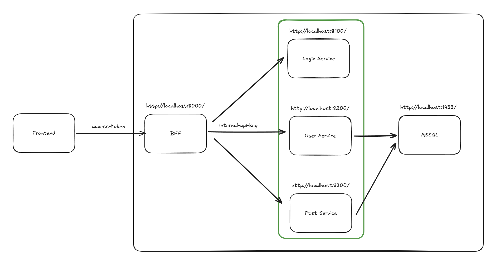

# BFF API Services

## Overview

This project contains the Backend-for-Frontend (BFF) API services designed to act as an intermediary between the frontend applications and backend systems. It simplifies data aggregation and provides tailored APIs for frontend needs.



1. **Frontend**: The user interface that interacts with the BFF API.
2. **BFF API**: The backend service that aggregates data from multiple sources and provides a simplified API for the frontend.
3. **Login Service**: Handles generate access tokens with OpenID Connect.
4. **User Service**: Manages user data.
5. **Post Service**: Manages posts and comments.
6. **Database**: Stores user and post data using Microsoft SQL Server.

Note: API Documentation is available at `/docs` endpoint.

## Features
- **User Authentication**: Secure login and token generation using OpenID Connect.
- **Data Aggregation**: Combines data from multiple services into a single API response.
- **Protected Endpoints**: Ensures that internal services are not directly accessible from the internet.


## Prerequisites

- **Python**: Ensure you have Python installed (version 3.11 or higher).
- **miniconda** and **poetry**: Install Miniconda and Poetry for package management.
- **Docker**: Install Docker for containerization.

## Installation (Docker)

1. Clone the repository:
    ```bash
    git clone https://github.com/your-repo/BFF-api-services.git
    cd BFF-api-services
    ```
2. Set up database name in `mssql/setup.sql`:
    ```sql
    CREATE DATABASE <your_database_name>;
    GO
    ```

3. Set up environment variables in `.env`:
    ```env
    ...
    # Login Service
    OIDC_ISSUER=
    OIDC_CLIENT_ID=
    OIDC_CLIENT_SECRET=
    OIDC_AUDIENCE=
    ...
    SA_PASSWORD=
    MSSQL_DB=<your_database_name>
    ```
4. Build Docker images:
    ```bash
    docker-compose build
    ```

## Usage

### Development
Start the development server by create a `docker-compose.override.yml` file:
```yaml
services:
  bff:
    restart: no
    volumes:
      - ./bff-service:/app
    command: /start-reload.sh
```
then run:
```bash
docker-compose up -d
```


### Production
Run the production server:
```bash
docker-compose -f docker-compose.yml up -d
```